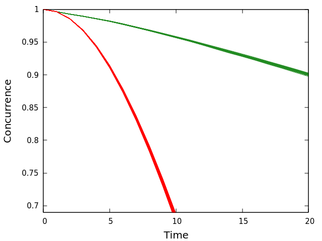
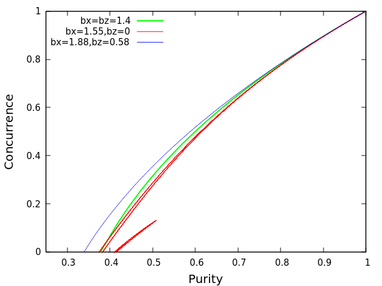

## Evolution of pairwise entanglement in a coupled n–body system

Carlos Pineda and Thomas H. Seligman

We study the exact evolution of two non-interacting qubits, initially in a Bell state, in the presence of an environment, modeled by a kicked Ising spin chain. Dynamics of this model range from integrable to chaotic and we can handle numerics for a large number of qubits. We find that the entanglement (as measured by concurrence) of the two qubits has a close relation to the purity of the pair, and follows an analytic relation derived for Werner states. As a collateral result we find that an integrable environment causes quadratic decay of concurrence, while a chaotic environment causes linear decay.

 [https://arxiv.org/abs/quant-ph/0503177v2](https://arxiv.org/abs/quant-ph/0503177v2)

To obtain the result showed in letter FIG. 2 we use the program *test-spins* with the option *test_evolution_letter_fig2*:

    $ make test_spins
    $ test_spins -o test_evolution_letter_fig2

To obtain FIG. 3 we use the program *test-spins* with the option *test_evolution_letter_fig3*:

    $ test_spins -o test_evolution_letter_fig3

These options execute the following code:

The `q` variable specifies the amount of qubits of the environment, and `dim` is its dimension

	int q = 13;
	int dim = pow_2(q);

The position of the qubits that define the central system is specified in binary form in the variable `which`, for example, `0000011`, with `00000` are the elements of the environment and `11` the elements of the central system, the variable is written in its decimal value.

    int which = 3;

The number of steps, or time, is specified in the `time_steps` variable, and are the times the magnetic kick will be applied.

    int time_steps = 20;

In variable `b`, the values of  are specified, which define whether it is a **chaotic** ( ), **regular** () or **intermediate** ( ) thermal bath.

    vec b(3);
    b(0) = 1.88;
    b(1) = 0.;
    b(2) = 0.58;

The value of the coupling strength between elements of the environment is indicated in `J`, and in `J_interaction` it is indicated the coupling strength between the central system and the environment.

    double J = 1.;
    double J_interaction = 0.03;

The number of times the system will run, with a different random environment each time, is indicated in `initial_conditions`.

    int initial_conditions = 60;

For each random environment the evolution of the system is stored in a file that will serve to graph the results, these files start with the name indicated in `startFileName`

    std::string startFileName = "test_";

For each data set, with the same thermal bath, a folder is indicated where all the files of the different initial conditions will be saved.

    std::string folderName1 = "../tests/q13_t20_b1.4";

For each initial condition (random environment) the following is done:

    state_env = RandomState(dim);              //get an initial random environment
    state_q = BellState(4);                    //get an initial central system (Bell state)
    state = TensorProduct(state_env, state_q); //join both environments
    rho = partial_trace_qubits(state, which);  //get back the system

Get the purity of the central system:

    itppextmath::Purity(rho)

And get concurrence of the central system:

    itppextmath::Purity(rho)

Save both values in its file

    myfile << i_time << " " << itppextmath::Purity(rho) << " " << itppextmath::Concurrence(rho) << endl;

In each step of time the magnetic kick is carried out by evolving the system with a thermal bath:

    apply_common_environment_chain(state, J, J_interaction, b);

When we obtain all the files, the script is executed to plot the results as in figure 2 (or 3)

    $ gnuplot
    gnuplot> load "fig2-evolution-of-concurrence.gp"
    gnuplot> load "fig3-evolution-of-concurrence.gp"

